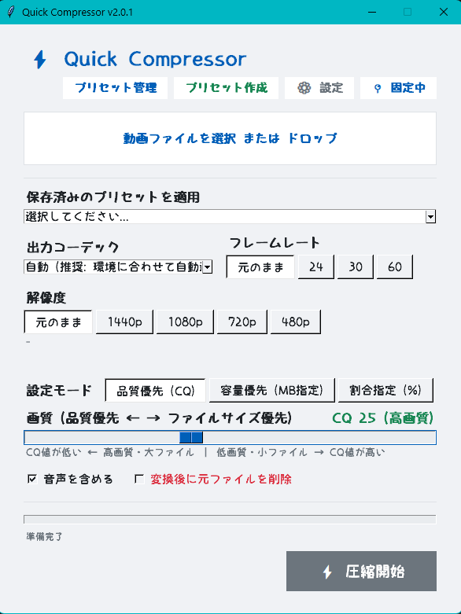
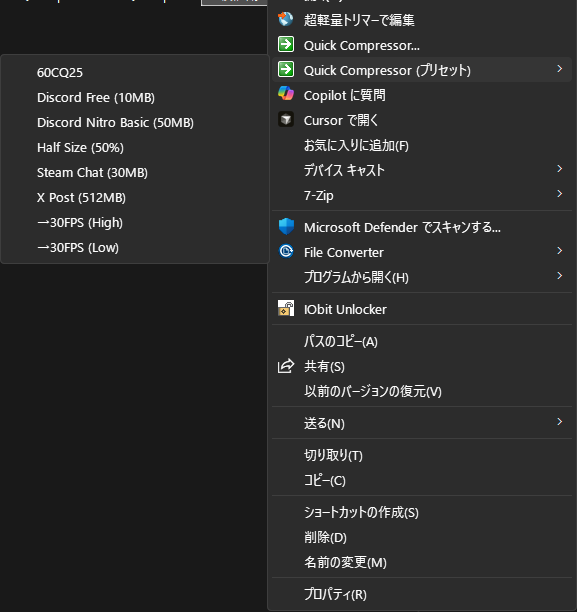
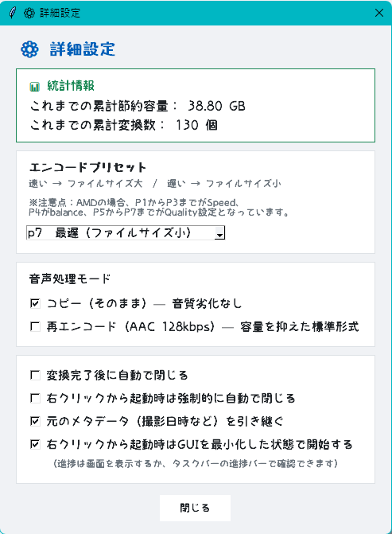

# Quick Compressor（仮名称）

## 概要

Discord（10MB）や、Steam Chat（30MB）など、極めて小さいファイル制限向けの圧縮ソフト。

---

## 主な機能

- **1.CQ指定での圧縮 (画質優先モード)** 比較的画質を保ったまま圧縮出来ます。
- **2.目標ファイルサイズ指定 (容量優先モード)** 「50MB以内に収める」など、目標とするファイルサイズを指定すると、自動的に最適なビットレートを計算し、指定容量に収まるように圧縮します。
- **3.割合指定での圧縮モード** 指定した割合以下に収まるように圧縮します。
- **レジストリからのプリセット実行 (プリセット連携)** 動画ファイルを右クリックし、表示されるプリセット（「Discord用」など）を選ぶと圧縮出来ます。 またプリセットは後から自分で作成することもできます
- **最前面に固定 （デフォルトでオン）** エクスプローラーを全画面表示にした状態でも、動画ファイルをドラッグアンドドロップ出来ます。
- **どこでもドラッグ機能** 画面中のどこを長押ししてもドラッグ出来ます。
- **複数ファイルを連続で処理** 複数の動画ファイルを指定することで、一つ一つ指定しなくても連続して圧縮出来ます。

---

## 使い方

### A：右クリックから素早く圧縮（プリセット使用）

1. 圧縮したい動画ファイル（`.mp4`, `.mkv`, `.mov` など）を選択して右クリック。
2. Windows 11 の場合は「その他のオプションを表示」をクリックし、**「Quick Compressor (プリセット)」** の中から「Discord用」などの目的に合ったプリセットを選択。
3. 自動的に設定が読み込まれ、圧縮が開始される。
この時、GUIを最小化して開くかどうかは設定画面から変更出来ます。

### B：GUIからの圧縮・プリセット管理

1. 動画ファイルを右クリックからプリセットではなく、「Quick Compressor」を選択、もしくはexeファイルを直接起動すると、GUI画面が表示されます。
2. あらかじめ用意されたプリセット内から選択することも出来ます。また用意されたプリセットを選んだあとに自分で細かい箇所を選択し直すことも出来ます
3. **「圧縮開始」** ボタンをクリックすると変換が開始されます。
4. **「プリセット作成」** ボタンを押すと、現在の設定を新しいプリセットとして保存し、レジストリに登録されるため、次から右クリックで使えるようになります。
5. **「プリセット管理」** ボタンからは、登録されているすべてのプリセットの名前変更や削除が行えます。

---

## インストール方法

1. [GitHub Releases](https://github.com/LunaFleuret/Quick-Compressor/releases) から最新Ver（一番上）の `QuickCompressor_Setup.exe` をダウンロードします。
2. ダウンロードしたインストーラーを実行します。Nextを押し進めると自動的にインストールが完了します。
3. インストールが完了すると、自動的にエクスプローラーの右クリックメニューレジストリへ登録されます。

### アンインストール

Windowsの「設定」＞「アプリ」＞「インストールされているアプリ」から「Quick Compressor」を選択してアンインストール。右クリックメニューレジストリへの登録も削除されます。

---

## 動作要件・パフォーマンス

### 動作要件

- **OS**: Windows 10 / 11 (64bit)
- **GPU**: NVIDIA製グラフィックボード（NVENC対応）または AMD製グラフィックボード（AMF対応）
- **依存ソフト**: 不要

> [注意]
> GPU非搭載のPCでは使用出来ません。

---

### 【圧縮にかかる時間を決定する要素】

GPUのハードウェアエンコードを使用するため、圧縮速度は主に以下の要素によって決定されます。予測時間も表示されますが、参考程度に。

1. **GPUの性能**: ハードウェアエンコーダー（NVENC/AMF）の性能が処理速度に直結します。
2. **元動画の長さ**: 処理するフレームの総数が増えるため、動画の再生時間に比例します。
3. **解像度とフレームレート**: 4Kや60FPSなどの高画質動画は、1秒あたりのデータ量（ピクセル数）が多いため処理が重くなります（出力設定の解像度・フレームレートも同様に影響します）。
4. **エンコードプリセット**: `p1` (速度優先) 〜 `p7` (画質優先) の設定があり、画質を重視するほどGPUの演算量が増えて時間がかかります。
5. **使用コーデック**: H.264に比べ、より新しいHEVC(H.265)やAV1は圧縮効率が高い分、計算負荷が上がります。
6. **ストレージの読み書き速度**: 圧縮後はサイズが小さくなるため書き出しへの影響は少ないですが、元ファイルが非常に大きい場合は読み込み速度が処理時間に影響します。

---

## 詳細設定

### 細かく変更出来る箇所

- **エンコードプリセット P1～P7**
  P1に行けば行くほど圧縮速度は早まりますが、ファイルサイズは肥大化します。
  逆にP7に行けば行くほど圧縮速度が遅くなる代わりに、ファイルサイズは縮小します。
  ※注意点：AMDの場合、P1からP3までがSpeed、P4がbalance、P5からP7までがQuality設定となっています。

- **音声エンコード**
  元の音声をそのままコピーして使用するか、AAC 124kbpsまで圧縮するか選択できます。

- **圧縮が終了したら自動で閉じる**
  この項目にチェックを入れると、圧縮が終了した瞬間にQuick Compressorを終了します。
  （主に「その他のオプション」から単発で使用する人におすすめ）
  ※右クリックメニューレジストリから使用した場合に、終了時点でソフトを閉じるかどうかをオン/オフ選択可能（デフォルトではオフ）。

- **最前面表示機能**
  このソフトはデフォルトで最前面に固定されています。
  画面右上のピン留めボタンで切り替え可能です。
  エクスプローラーを全画面表示にしていても、そのままドラッグアンドドロップが出来ます。

### プリセット管理について

デフォルトではそれぞれの「音声なし」で書き出すプリセットが非表示になってます。
この画面からチェックを外すことにより、音声なしの圧縮にも簡単に対応出来ます。
音声なしをプリセットとして自分で作成することもできます。
また、プリセットの削除、名前の変更はここから行えます。

## ライセンス・クレジット

### 内蔵フォント

本ソフトウェアのGUIには、あおいりい様制作のフリーフォント「りぃポップ角」を使用しています。

- フォント名：りぃポップ角
- 作者：あおいりい 様
- 配布サイト：[りいのフォント](http://aoirii.babyblue.jp/font/)
