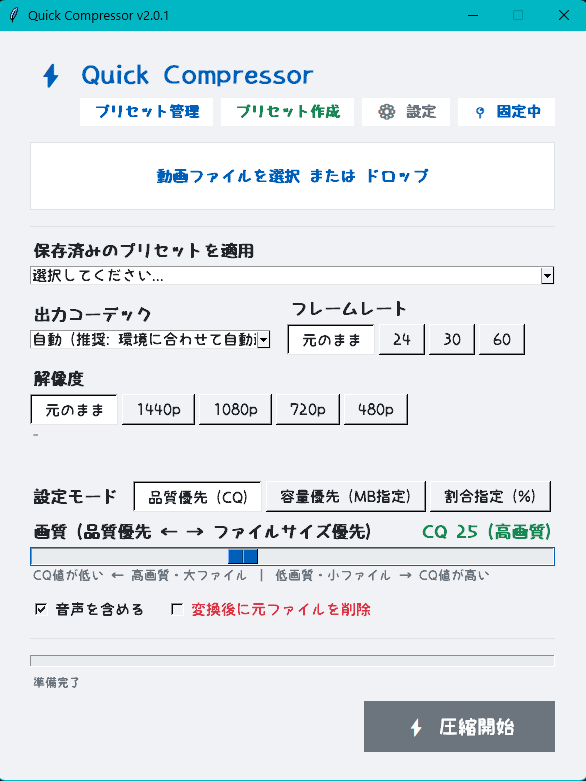
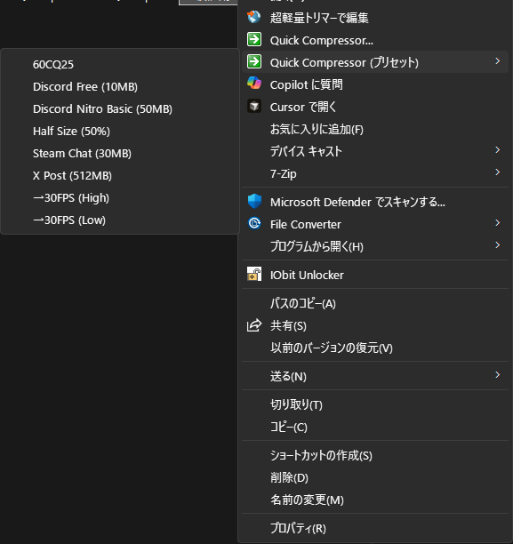
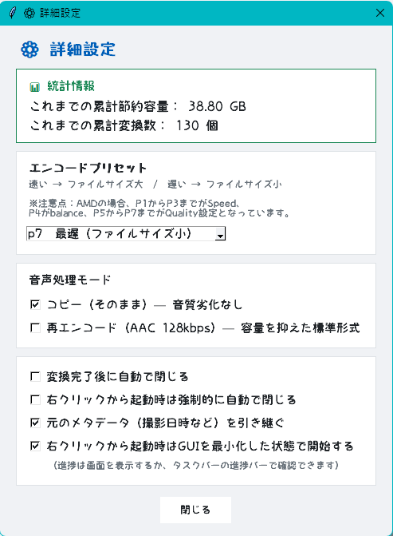

# Quick Compressor

[日本語](README.md) | [English](README.en.md) | [简体中文](README.zh-CN.md)

---

## 概述

专为 Discord（10MB限制）和 Steam Chat（30MB限制）等有极小文件大小限制的平台设计的高速视频压缩工具。

**必须配备 GPU 硬件编码器（不支持仅 CPU 运行）。**

---

## 主要功能

- **目标文件大小指定（容量优先模式）**：指定目标文件大小（如“控制在 10MB 以内”），程序将自动计算最佳码率并压缩至指定大小。
- **按比例压缩模式**：按指定比例压缩视频文件，使其体积缩小至原始比例以下。
- **右键菜单与预设联动**：右键点击视频文件，选择对应预设（如“Discord专用”）即可立即开始压缩。
- **自定义预设创建**：可自由调整分辨率、编码格式等并保存为新预设，自动同步至 Windows 右键菜单。
- **置顶显示（默认开启）**：即使文件资源管理器全屏显示，也可轻松拖放视频文件进行加载。
- **窗口任意位置拖动**：按住窗口任意空白区域即可自由拖动窗口位置。
- **批量排队处理（队列）**：支持添加多个视频文件依次连续执行压缩处理。

---

## 使用方法

### A：通过右键菜单快速压缩（使用预设）

1. 选中要压缩的视频文件（`.mp4`, `.mkv`, `.mov` 等）并点击右键。
2. Windows 11 用户请点击“显示更多选项”，在 **“Quick Compressor (预设)”** 中选择符合需求的预设（如“Discord专用”）。
3. 程序将自动读取配置并开始压缩。
   *(※可在设置窗口中修改启动时是否最小化界面。)*

### B：通过 GUI 界面压缩与预设管理

1. 直接运行程序可执行文件或从右键菜单选择“Quick Compressor”打开主界面。
2. 从预设列表中选择，或手动微调分辨率、编码格式和目标容量。
3. 点击 **“开始压缩”** 按钮执行转换。
4. 点击 **“创建预设”** 按钮将当前设置保存为新预设，并自动写入注册表供右键菜单使用。
5. 点击 **“预设管理”** 按钮可对所有预设进行重命名、删除或切换显示/隐藏。

---

## 安装方法

1. 前往 [GitHub Releases](https://github.com/LunaFleuret/Quick-Compressor/releases) 下载最新版本的 `QuickCompressor_Setup.exe`。
2. 运行下载的安装程序，按照提示完成安装。
3. 安装完成后，右键菜单项将自动注册到 Windows 文件资源管理器中。

### 卸载方法

在 Windows“设置” > “应用” > “已安装的应用”中找到 **Quick Compressor** 并点击“卸载”。右键菜单注册表项将自动清理。

---

## 运行环境与性能

### 运行环境

- **操作系统**: Windows 11 (64位)
- **显卡 (GPU)**: NVIDIA 显卡（支持 NVENC）或 AMD 显卡（支持 AMF）
- **依赖项**: 无（独立可执行文件）

> [!WARNING]
> 未搭载独立显卡（或不支持硬件编码）的 PC 环境无法使用此软件。

---

### 影响压缩时间的因素

由于采用 GPU 硬件编码，压缩速度主要受以下因素影响：

1. **原视频时长**：待处理的总帧数与播放时长成正比。
2. **GPU 性能**：硬件编码器（NVENC / AMF）的性能直接决定处理速度（CPU 瓶颈可能导致吞吐量达到上限）。
3. **分辨率与帧率**：4K 或 60FPS 等高画质视频数据量大（每秒像素数多），处理负载更高。
4. **编码预设 (P1 ～ P7)**：`P1`（速度优先）至 `P7`（画质优先）——画质要求越高，GPU 运算开销越大，耗时越长。
5. **编码格式**：HEVC (H.265) 和 AV1 的压缩率优于 H.264，但算法计算复杂度更高。
6. **存储读写速度**：原视频文件极大时，磁盘读取速度可能会限制整体处理速度。

*※对于已高度压缩的视频（如从 YouTube 等平台下载的视频），再次压缩可能效果不明显，甚至可能导致体积增大。*

---

## 详细设置

- **编码预设 (P1 ～ P7)**：
  - 数字越小速度越快，但文件体积稍大。
  - 数字越大文件体积越小、画质更好，但编码速度变慢。
  - *(※AMD 显卡：P1-P3 对应 Speed，P4 对应 Balance，P5-P7 对应 Quality)*
- **音频编码**：可选择直接复制原音频流，或重新编码为 AAC 124kbps。
- **完成后自动关闭**：勾选后在压缩完成时自动退出 Quick Compressor。
- **置顶显示**：可通过右上角图钉按钮随时切换窗口置顶状态。
- **预设管理**：显示/隐藏无音频预设、删除或重命名预设。

---

## 许可证

MIT License
